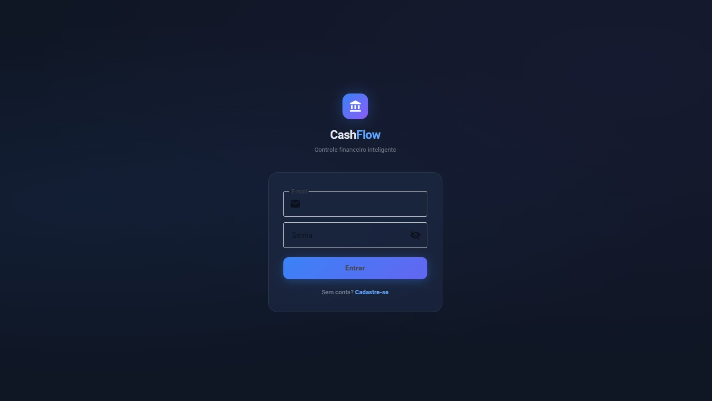
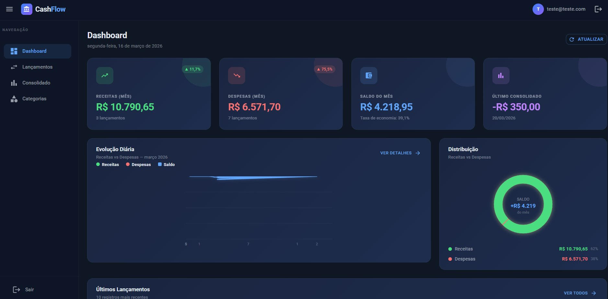
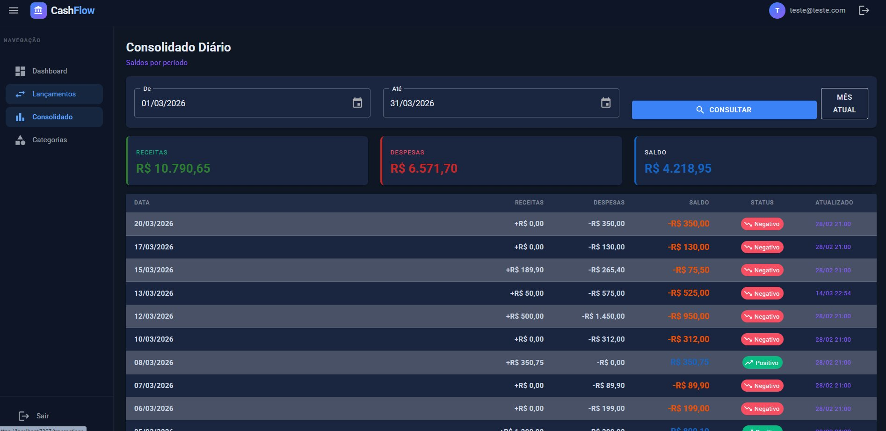

# CashFlow — Sistema de Controle de Fluxo de Caixa

[](https://dotnet.microsoft.com)
[](https://dotnet.microsoft.com/apps/aspnet/web-apps/blazor)
[](https://www.docker.com)
[](https://www.rabbitmq.com)
[](https://www.microsoft.com/sql-server)
[](https://mudblazor.com)

Sistema de microsserviços para controle de lançamentos financeiros com consolidação diária assíncrona, interface Blazor WebAssembly e testes de carga K6.

---

## Screenshots

### Login


### Dashboard


### Consolidado Diário


---

## Desenho da Solução

```
┌─────────────────────────────────────────────────────────────────────────────┐
│                              CLIENTE (Browser)                               │
│                                                                              │
│   ┌──────────────────────────────────────────────────────────────────────┐  │
│   │                  CashFlow.WebApp (Blazor WASM)                       │  │
│   │   MudBlazor 8.6 · Blazored.LocalStorage · SDK BlazorWebAssembly     │  │
│   │                                                                      │  │
│   │   /login     /register     /           /transactions   /consolidation│  │
│   │   Login      Registro    Dashboard    Lançamentos     Consolidado    │  │
│   └──────┬───────────┬──────────────┬────────────────────────┬──────────┘  │
│          │           │              │                         │              │
│     HTTP/HTTPS  HTTP/HTTPS    HTTP/HTTPS                HTTP/HTTPS          │
└──────────┼───────────┼──────────────┼─────────────────────────┼────────────┘
           │           │              │                         │
           ▼           │              ▼                         ▼
┌──────────────────┐   │   ┌─────────────────────┐   ┌─────────────────────┐
│  Auth API :5001  │   │   │ Transactions API     │   │ Consolidation API   │
│                  │◄──┘   │ :5002                │   │ :5003               │
│  NetDevPack JWT  │       │                      │   │                     │
│  RSA Rotating    │       │  POST /transactions  │   │  GET /latest        │
│  Keys + Argon2   │       │  GET  /transactions  │   │  GET /period        │
│                  │       │  PUT  /transactions  │   │  GET /{date}        │
│  /register       │       │  DELETE /transactions│   │                     │
│  /login          │       │  GET /categories     │   │  Consumer RabbitMQ  │
│  /refresh-token  │       │                      │   │  (BackgroundService)│
│  /logout         │       │  [Authorize JWT]     │   │  [Authorize JWT]    │
│                  │       │  Rate Limit 500/s    │   │  Rate Limit 500/s   │
│  JWKS endpoint   │       │  Polly Retry/CB      │   │  IMemoryCache 30s   │
│  /.well-known    │       │                      │   │                     │
│  /jwks           │       └──────────┬───────────┘   └──────────┬──────────┘
└──────────────────┘                  │                           │
           │                          │                           │
           │              ┌───────────▼───────────┐              │
           │              │     RabbitMQ :5672     │◄─────────────┘
           │              │                        │
           │              │  Exchange:             │
           │              │  cashflow.transactions │
           │              │  (Direct, Durable)     │
           │              │                        │
           │              │  Routing Keys:         │
           │              │  transaction.created   │
           │              │  transaction.updated   │
           │              │  transaction.deleted   │
           │              │                        │
           │              │  DLQ com TTL 24h       │
           │              │  Retry 3x exponencial  │
           │              └────────────────────────┘
           │
           ▼
┌─────────────────────────────────────────────────────────────────────────────┐
│                          SQL Server 2022 :1433                               │
│                                                                              │
│   ┌──────────────────┐  ┌──────────────────┐  ┌──────────────────────────┐ │
│   │    AuthDb        │  │  TransactionDb   │  │     ConsolidationDb      │ │
│   │                  │  │                  │  │                          │ │
│   │ auth.Users       │  │ Transactions     │  │ DailyBalances            │ │
│   │ auth.Roles       │  │ TransactionCat.  │  │                          │ │
│   │ auth.UserRoles   │  │                  │  │ IX_Date (unique)         │ │
│   │ auth.UserTokens  │  │ IX_Date          │  │                          │ │
│   │ SecurityKeys     │  │ IX_Type          │  │ Seed: 19 registros       │ │
│   │ (RSA Keys)       │  │ IX_Date_Type     │  │                          │ │
│   │                  │  │                  │  │                          │ │
│   │ Seed: nenhum     │  │ Seed: 13 categ.  │  │                          │ │
│   │                  │  │ Seed: 25 lanç.   │  │                          │ │
│   └──────────────────┘  └──────────────────┘  └──────────────────────────┘ │
└─────────────────────────────────────────────────────────────────────────────┘
```

---

## Fluxo de Dados

```
Usuário
  │
  ├─► POST /api/v1/auth/login
  │         │
  │         └─► JWT com RSA (NetDevPack rotating keys)
  │                   │
  │                   └─► Bearer Token armazenado no localStorage (WASM)
  │
  ├─► POST /api/v1/transactions  [Authorization: Bearer <token>]
  │         │
  │         ├─► Valida JWT via JWKS (/.well-known/jwks)
  │         ├─► Persiste lançamento no SQL Server
  │         └─► Publica TransactionCreatedEvent no RabbitMQ
  │                   │
  │                   └─► [Assíncrono] ConsolidationConsumer
  │                               │
  │                               ├─► Processa evento
  │                               ├─► Atualiza DailyBalance no SQL Server
  │                               └─► Invalida cache (IMemoryCache TTL 30s)
  │
  └─► GET /api/v1/daily-consolidation/latest  [Authorization: Bearer <token>]
            │
            ├─► Verifica cache (IMemoryCache TTL 30s)
            └─► Retorna DailyBalance consolidado
```

---

## Estrutura do Projeto

```
CashFlow/
├── src/
│   ├── CashFlow.Shared/                    # Biblioteca compartilhada
│   │   ├── Abstractions/                   # Interfaces (IRepository, IEntity...)
│   │   ├── Extensions/                     # ServiceCollectionExtensions (Serilog, Polly)
│   │   ├── Middleware/                     # CorrelationIdMiddleware
│   │   ├── Models/                         # ApiResponse<T>, PagedResponse<T>
│   │   └── Resilience/                     # ResiliencePolicies (Polly Retry + CB)
│   │
│   ├── CashFlow.Auth.API/                  # Autenticação JWT — porta 5001
│   │   ├── Controllers/v1/AuthController   # register, login, refresh-token, logout
│   │   ├── Data/AuthDbContext              # Identity + ISecurityKeyContext
│   │   ├── Models/                         # ApplicationUser, AuthRequests
│   │   └── Services/TokenService          # IJwtBuilder (NetDevPack)
│   │
│   ├── CashFlow.Transactions.API/          # Lançamentos — porta 5002
│   │   ├── Controllers/v1/                 # TransactionsController, CategoriesController
│   │   ├── Data/                           # TransactionDbContext, Repositories, FluentAPI
│   │   ├── Domain/                         # Transaction, TransactionCategory (entities)
│   │   ├── Infrastructure/Messaging/       # RabbitMqPublisher (lazy connection)
│   │   └── Services/                       # TransactionService, CategoryService
│   │
│   ├── CashFlow.Consolidation.API/         # Consolidado diário — porta 5003
│   │   ├── Controllers/v1/                 # DailyConsolidationController
│   │   ├── Data/                           # ConsolidationDbContext, Repositories
│   │   ├── Domain/                         # DailyBalance (entity)
│   │   ├── Infrastructure/Messaging/       # TransactionCreatedConsumer (DLQ + retry)
│   │   └── Services/ConsolidationService  # IMemoryCache TTL 30s
│   │
│   └── CashFlow.WebApp/                    # Blazor WASM — porta 5000
│       ├── Pages/                          # Login, Register, Dashboard, Transactions...
│       ├── Layout/                         # MainLayout (MudBlazor), EmptyLayout
│       ├── Shared/                         # AuthGuard, TransactionDialog
│       ├── Services/                       # AuthService, TransactionService, ConsolidationService
│       └── wwwroot/                        # index.html, appsettings.json, css
│
├── tests/
│   ├── CashFlow.Transactions.Tests/        # 29 testes unitários (xUnit + Moq)
│   │   ├── Domain/TransactionTests         # 9 testes de domínio
│   │   ├── Domain/TransactionCategoryTests # 4 testes de domínio
│   │   ├── Services/TransactionServiceTests       # 11 testes de serviço
│   │   └── Services/CategoryServiceTests          # 5 testes de serviço
│   │
│   ├── CashFlow.Consolidation.Tests/       # 46 testes unitários (xUnit + Moq)
│   │   ├── Domain/DailyBalanceTests        # 12 testes de domínio
│   │   └── Services/ConsolidationServiceTests     # 34 testes de serviço
│   │
│   └── k6/                                # Testes de carga K6
│       ├── helpers/                        # config.js, auth.js
│       └── scenarios/                      # auth, transactions, consolidation,
│                                           # resilience, full-suite
│
└── docker-compose.yml                      # 6 serviços orquestrados
```

---

## Stack Tecnológica

### Backend
| Componente | Tecnologia | Versão |
|-----------|------------|--------|
| Framework | ASP.NET Core | 10.0 |
| ORM | Entity Framework Core | 10.0 |
| Banco de dados | SQL Server | 2022 |
| Mensageria | RabbitMQ | 4.x |
| JWT (Auth) | NetDevPack.Security.Jwt | 9.0.3 |
| Password Hash | NetDevPack.Identity.Argon2 | 9.0.3 |
| Resiliência | Polly | 8.6.1 |
| Logs | Serilog | 9.0.0 |
| Health Checks | AspNetCore.HealthChecks | 9.0.0 |
| API Docs | Swashbuckle (Swagger) | 7.3.1 |
| Versionamento API | Asp.Versioning | 8.1.0 |

### Frontend
| Componente | Tecnologia | Versão |
|-----------|------------|--------|
| Framework | Blazor WebAssembly | .NET 10 |
| UI Components | MudBlazor | 8.6.0 |
| Storage | Blazored.LocalStorage | 4.5.0 |
| HTTP | AddHttpClient<T> (typed clients) | 10.0 |

### Testes
| Tipo | Tecnologia | Qtd |
|------|------------|-----|
| Unitários | xUnit + Moq + FluentAssertions | 75 testes |
| Carga | K6 | 5 cenários |

---

## Decisões de Arquitetura

### Resiliência: Transactions independente do Consolidation
O requisito exige que o serviço de lançamentos não fique indisponível se o consolidado cair. Isso é garantido por:
- **Comunicação assíncrona via RabbitMQ** — Transactions publica evento e retorna 201 imediatamente, sem esperar o Consolidation
- **RabbitMqPublisher com conexão lazy** — se o RabbitMQ não estiver disponível, o lançamento é salvo no banco e o evento não publicado é logado como Warning (não quebra o fluxo)
- **Dead Letter Queue** — mensagens que falham após 3 tentativas com backoff exponencial (2s/4s/8s) vão para a DLQ com TTL de 24h para reprocessamento manual

### JWT com RSA Rotating Keys (NetDevPack)
Em vez de chave simétrica compartilhada (`Jwt:Secret`), a Auth API usa pares de chaves RSA rotacionadas automaticamente:
- Chaves persistidas na tabela `SecurityKeys` do banco
- Endpoint `/.well-known/jwks` exposto publicamente
- Transactions e Consolidation validam tokens consultando o JWKS — sem precisar do Secret
- Senha com Argon2 (mais seguro que BCrypt)

### OutputCache e Rate Limiting
- **Categorias**: cache de 1h (dados estáticos que raramente mudam)
- **Consolidado**: cache de 30s por rota (atualizado pelo consumer assíncrono)
- **Rate Limiter**: Token Bucket 500 tokens / 200 por segundo (permite picos)
- **Auth**: Fixed Window 10 req/min (proteção contra brute force)

---

## Pré-requisitos

- [Docker Desktop](https://www.docker.com/products/docker-desktop) ou Docker + Docker Compose
- [.NET 10 SDK](https://dotnet.microsoft.com/download) (para desenvolvimento local)
- [K6](https://k6.io/docs/get-started/installation/) (para testes de carga)

---

## Executar com Docker Compose

```bash
# Clona o repositório
git clone https://github.com/LeandroOLC/CashFlow.git
cd CashFlow

# Sobe todos os serviços
docker-compose up --build

# Ou em background
docker-compose up -d --build

# Verificar se todos subiram
docker-compose ps
```

Aguardar o SQL Server e RabbitMQ ficarem healthy (cerca de 30-60s na primeira vez). As migrations são executadas automaticamente no startup de cada API.

---

## Executar em Desenvolvimento Local

```bash
# Terminal 1 — SQL Server e RabbitMQ via Docker
docker-compose up -d sqlserver rabbitmq

# Terminal 2 — Auth API
cd src/CashFlow.Auth.API
dotnet run

# Terminal 3 — Transactions API
cd src/CashFlow.Transactions.API
dotnet run

# Terminal 4 — Consolidation API
cd src/CashFlow.Consolidation.API
dotnet run

# Terminal 5 — WebApp
cd src/CashFlow.WebApp
dotnet run
```

---

## Acessos

| Serviço | URL | Descrição |
|---------|-----|-----------|
| **WebApp** | http://localhost:5000 | Interface Blazor WASM |
| **Auth API** | http://localhost:5001 | Autenticação JWT |
| **Transactions API** | http://localhost:5002 | Lançamentos financeiros |
| **Consolidation API** | http://localhost:5003 | Saldos consolidados |
| **Swagger Auth** | http://localhost:5001/swagger | Documentação Auth |
| **Swagger Transactions** | http://localhost:5002/swagger | Documentação Transactions |
| **Swagger Consolidation** | http://localhost:5003/swagger | Documentação Consolidation |
| **RabbitMQ Management** | http://localhost:15672 | guest / guest |

---

## Endpoints

### Auth API — `http://localhost:5001`

| Método | Rota | Auth | Descrição |
|--------|------|------|-----------|
| `POST` | `/api/v1/auth/register` | — | Criar conta |
| `POST` | `/api/v1/auth/login` | — | Login → JWT + RefreshToken |
| `POST` | `/api/v1/auth/refresh-token` | — | Renovar token |
| `POST` | `/api/v1/auth/logout` | JWT | Encerrar sessão |
| `GET` | `/.well-known/jwks` | — | Chaves públicas RSA |

### Transactions API — `http://localhost:5002`

| Método | Rota | Auth | Descrição |
|--------|------|------|-----------|
| `GET` | `/api/v1/transactions` | JWT | Listar paginado (filtros: page, pageSize, startDate, endDate, type) |
| `GET` | `/api/v1/transactions/{id}` | JWT | Buscar por ID |
| `POST` | `/api/v1/transactions` | JWT | Criar lançamento |
| `PUT` | `/api/v1/transactions/{id}` | JWT | Atualizar |
| `DELETE` | `/api/v1/transactions/{id}` | JWT | Remover |
| `GET` | `/api/v1/transaction-categories` | JWT | Listar categorias |
| `GET` | `/api/v1/transaction-categories/{id}` | JWT | Buscar categoria |
| `GET` | `/health/live` | — | Liveness probe |
| `GET` | `/health/ready` | — | Readiness probe (SQL + RabbitMQ) |

### Consolidation API — `http://localhost:5003`

| Método | Rota | Auth | Descrição |
|--------|------|------|-----------|
| `GET` | `/api/v1/daily-consolidation/latest` | JWT | Saldo mais recente |
| `GET` | `/api/v1/daily-consolidation/{date}` | JWT | Saldo por data (yyyy-MM-dd) |
| `GET` | `/api/v1/daily-consolidation/period` | JWT | Saldo por período paginado |
| `GET` | `/health/live` | — | Liveness probe |
| `GET` | `/health/ready` | — | Readiness probe (SQL + RabbitMQ) |

---

## Testes Unitários

```bash
# Todos os testes
dotnet test

# Com relatório detalhado
dotnet test --logger "console;verbosity=detailed"

# Apenas Transactions
dotnet test tests/CashFlow.Transactions.Tests

# Apenas Consolidation
dotnet test tests/CashFlow.Consolidation.Tests
```

**Cobertura:** 75 testes unitários distribuídos em:
- `TransactionTests` — 9 testes (domínio)
- `TransactionCategoryTests` — 4 testes (domínio)
- `TransactionServiceTests` — 11 testes (serviço)
- `TransactionCategoryServiceTests` — 5 testes (serviço)
- `DailyBalanceTests` — 12 testes (domínio)
- `ConsolidationServiceTests` — 34 testes (serviço com IMemoryCache real)

---

## Testes de Carga (K6)

### Instalação

```bash
# Windows
choco install k6

# macOS
brew install k6

# Linux
sudo apt-get install k6
```

### Requisitos validados

| Requisito | Teste | Threshold |
|-----------|-------|-----------|
| Transactions não cai se Consolidation cair | `resilience.test.js` | `transactions_available > 99%` |
| Consolidation suporta 50 req/s em pico | `consolidation.test.js` | `http_req_failed < 5%` |
| Máx 5% perda em pico | `consolidation.test.js` cenário `sla_peak` | `consolidation_loss_rate < 5%` |

### Executar testes de carga

```bash
# Sobe os serviços
docker-compose up -d

# SLA do consolidado — 50 req/s por 3 minutos (cenário principal)
k6 run tests/k6/scenarios/consolidation.test.js

# Resiliência — Transactions com Consolidation caído
k6 run tests/k6/scenarios/resilience.test.js
# Em outro terminal, após 70s:
# docker stop cashflow-consolidation

# Suite completa — todos os serviços em paralelo
k6 run tests/k6/scenarios/full-suite.test.js

# Transactions — CRUD completo com pico de 50 req/s
k6 run tests/k6/scenarios/transactions.test.js
```

### Saída esperada do teste de SLA

```
✓ http_req_failed............: 1.8%    threshold: < 5%     PASSOU
✓ consolidation_loss_rate....: 1.8%    threshold: < 5%     PASSOU
✓ http_req_duration...........: p(95)=312ms  threshold: p(95)<500ms  PASSOU
✓ transactions_available.....: 99.7%   threshold: > 99%    PASSOU
```

---

## Padrões e Boas Práticas

| Padrão | Implementação |
|--------|--------------|
| Repository Pattern | `IRepository<T>`, `ITransactionRepository`, `IDailyBalanceRepository` |
| SOLID | Factory methods, private constructors, interface segregation |
| FluentAPI | Zero DataAnnotations — toda configuração via `IEntityTypeConfiguration<T>` |
| Correlation ID | `X-Correlation-Id` propagado em todos os logs e respostas |
| API Versioning | `/api/v1/...` via `Asp.Versioning.Mvc` |
| Structured Logging | Serilog com `BeginScope`, `CorrelationId`, enrichers |
| Health Checks | `/health/live` (processo) e `/health/ready` (dependências) |
| Circuit Breaker | Polly — 5 falhas → 60s aberto (banco de dados) |
| Retry | Polly — 3 tentativas, backoff exponencial 2s/4s/8s |
| Dead Letter Queue | RabbitMQ DLQ com TTL 24h e retry no consumer |
| Rate Limiting | Token Bucket (APIs) e Fixed Window (login) |
| Multi-stage Docker | Build com SDK → Runtime com aspnet:10.0 |

---

## Variáveis de Ambiente (Docker Compose)

| Variável | Serviço | Descrição |
|----------|---------|-----------|
| `ConnectionStrings__AuthDb` | auth | Connection string SQL Server |
| `ConnectionStrings__TransactionDb` | transactions | Connection string SQL Server |
| `ConnectionStrings__ConsolidationDb` | consolidation | Connection string SQL Server |
| `AppSettings__Issuer` | auth | Issuer do JWT |
| `AppSettings__Audience` | auth | Audience do JWT |
| `Auth__JwksUri` | transactions, consolidation | URL do JWKS da Auth API |
| `RabbitMQ__Host` | transactions, consolidation | Host do RabbitMQ |
| `Swagger__Enabled` | todos | Habilita Swagger em produção |
| `ASPNETCORE_ENVIRONMENT` | todos | Development / Production |

---

## Seed Data

As migrations incluem dados iniciais para facilitar o desenvolvimento:

### TransactionDb
- **13 categorias** pré-cadastradas (Salário, Freelance, Alimentação, Transporte...)
- **25 lançamentos** de exemplo (Fev/Mar 2025) com GUIDs fixos

### ConsolidationDb
- **19 saldos diários** consolidados (Fev/Mar 2025) calculados a partir dos lançamentos seed

---

## Licença

MIT
